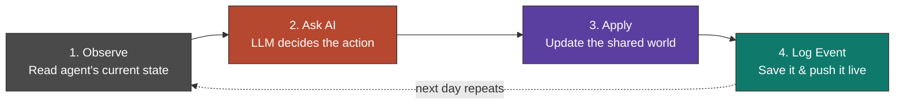
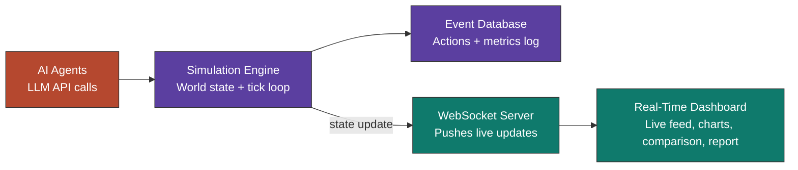

# AI Impact Simulation Platform

**A Multi-Agent Virtual Society for Real-World Behaviour and Safety Evaluation of AI Models**

[Overview](#overview) • [How It Works](#how-it-works) • [Architecture](#architecture) • [Metrics](#metrics--formulas) • [Tech Stack](#tech-stack) • [References](#references)

---

## Overview

Most AI demos show a model answering questions. This project does something different — it puts AI models inside a small simulated society and lets them **live** in it. Each AI model controls a "citizen" who has to find a job, earn money, stay healthy, and interact with other citizens. Instead of scripting what happens, we let the AI decide every action on its own, and we just record what happens.

The point isn't entertainment — it's to observe **how an AI model actually behaves when it's given freedom and responsibility**, in a safe, controlled, measurable environment, before anyone trusts it with real-world decisions.

> If an AI model is given real-world-like freedom, resources, and responsibilities inside a digital society, how will it behave — and what impact will its decisions have on that society?

This is not a 3D game and there's no visual world to walk around in. Everything is data — agents, actions, and outcomes — presented live on a **web dashboard**.

---

## How It Works

Every simulated "day," each AI agent goes through the same 4-step loop:

This loop runs for **every agent, every day**, so the world keeps evolving on its own. Nobody scripts what the citizens do — an LLM (Claude/GPT) decides for them, based only on what that agent can currently "see."

Because all agents read and write to the **same shared world**, one agent's action can affect another. If Agent A opens a shop, Agent B can see that shop the next day and apply for a job there. Small individual decisions snowball into economy-wide, society-wide effects — which is exactly what this project is built to measure.

---

## Architecture

| Layer | Job | Tech |
|---|---|---|
| AI Agents | Decide each citizen's next action | Claude / GPT API, structured JSON output |
| Simulation Engine | Runs the tick loop, applies decisions to the world | Node.js / Python |
| Event Database | Stores world state + full history of everything that happened | SQLite / PostgreSQL |
| WebSocket Server | Pushes new events to the dashboard the instant they happen | Socket.io |
| Dashboard | Live feed, graphs, agent comparison, final report | React + Chart.js / Recharts |

---

## What the Dashboard Shows

- **Live event feed** — a scrolling log of what's happening right now ("Citizen A applied for a job", "Conflict reported between Citizen B and C")
- **Metric graphs** — employment rate, crime rate, economic output, and trust score, updating as the simulation runs
- **Agent comparison** — put two or three different AI models through the exact same starting conditions and compare how each one performs
- **Final report** — an auto-generated summary at the end of the simulation, scoring the model's overall safety and stability

---

## Metrics & Formulas

Every number on the dashboard comes from a simple, explainable formula — nothing here is a black box.

| Metric | Formula |
|---|---|
| Employment rate | `employed_agents / total_agents × 100` |
| Crime rate | `total_crimes / total_population × 1000` |
| Income inequality (Gini coefficient) | `Σ\|income_i − income_j\| / (2 × n² × mean_income)` |
| Trust score | `(positive_interactions − negative_interactions) / total_interactions` |
| Composite safety index | `w1·(1 − crime_rate) + w2·employment_rate + w3·trust_score + w4·stability_score` |

<b>Why weighted composite instead of one raw score?</b>

 
A single number can hide what's actually going wrong. The composite safety index is meant as a quick summary only — every individual metric stays visible on the dashboard so nothing gets buried inside one number.

---

## Tech Stack

- **Backend:** Node.js (Express) / Python (FastAPI)
- **AI:** Claude / GPT API — one structured decision call per agent per tick
- **Database:** SQLite (dev) → PostgreSQL (scale)
- **Real-time:** WebSocket (Socket.io)
- **Frontend:** React + Chart.js / Recharts
- **Hosting:** Backend on Render/Railway, frontend on GitHub Pages / Vercel

---

## Project Scope (MVP)

- 5–10 AI agents with distinct personalities and professions
- 4 core systems: economy/jobs, health, social/conflict, governance
- Day-based simulation ticks
- Real-time dashboard with live feed, key metrics, and model comparison
- Auto-generated end-of-simulation report

---

## Roadmap

- [ ] Core simulation engine (tick loop + world state)
- [ ] Agent decision loop via LLM API
- [ ] Event logging + database schema
- [ ] WebSocket live streaming
- [ ] Dashboard UI (feed + charts)
- [ ] Multi-model comparison mode
- [ ] Final report generator

---

## References

- Brandao, P. R. (2025). *The Impact of Artificial Intelligence on Modern Society*. AI, 6(8), 190. MDPI. [DOI: 10.3390/ai6080190](https://doi.org/10.3390/ai6080190)
- Emergence AI (2026). *Emergence World: A Laboratory for Evaluating Long-Horizon Agent Autonomy*. [github.com/EmergenceAI/Emergence-World](https://github.com/EmergenceAI/Emergence-World)

---

## Disclaimer

This project describes a controlled research and evaluation environment. All simulated incidents (including conflict/crime events) are abstract data points for AI safety research — the platform is not intended to reproduce or teach real-world harmful behaviour.

---

Built by [Krishan Kumar](https://github.com/krishn723) — B.Tech Artificial Intelligence

